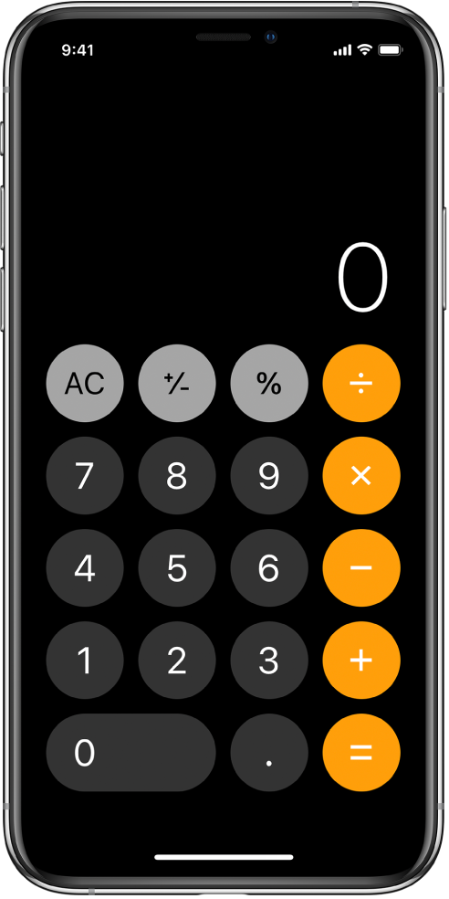

# ios Calculator

- ios calculator look a like created with React Native for both iOS and Android platforms

## Install and run
- clone from git [repository] (https://github.com/davidv16/ios-calculator.git)
- run npm install from root dir
- run npm start and say yes to expo cli install
- Run either in browser or through a tunnel to a smartphone
